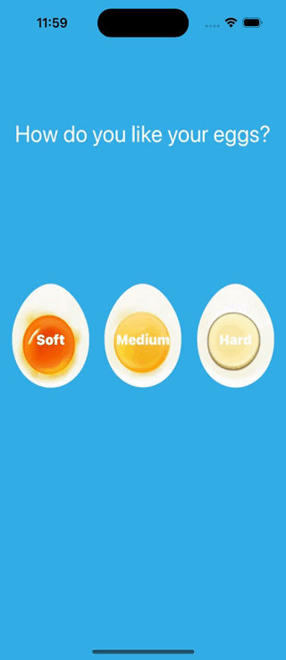

# Egg Timer Swift App

## What was do in this app

A beautiful egg timer app to boil your eggs to perfection depending on how you prefer your eggs. Used Swift Timer API and AVAudioPlayer to play a sound after the timer expires.

## What was used to make this app

* The Swift Programming Language
* Storyboard
* Autolayout for UI elements
* Enumerations
* The Swift Timer API
* Conditional statements - IF/ELSE
* Conditional statements - Switch
* Functions with outputs
* ProgressView used

## Example what the application do

